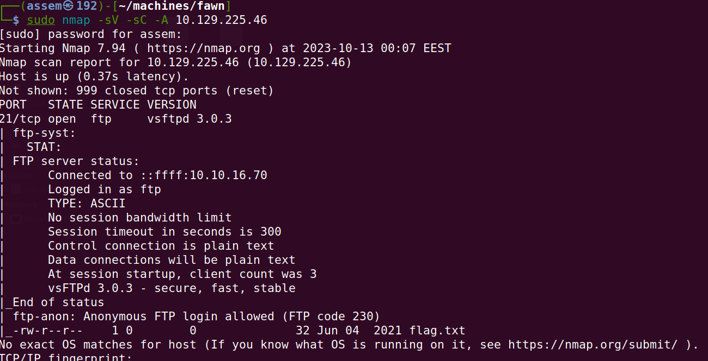
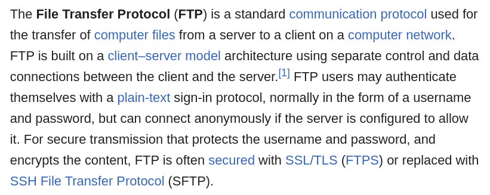
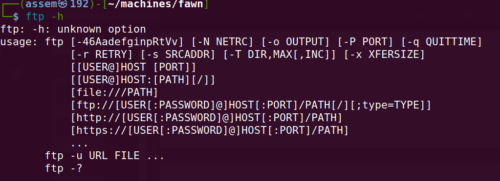
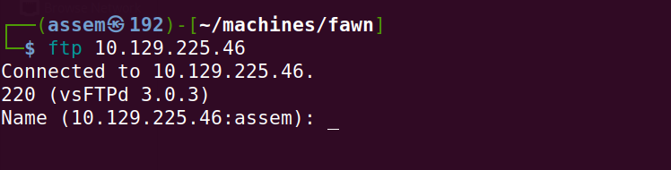
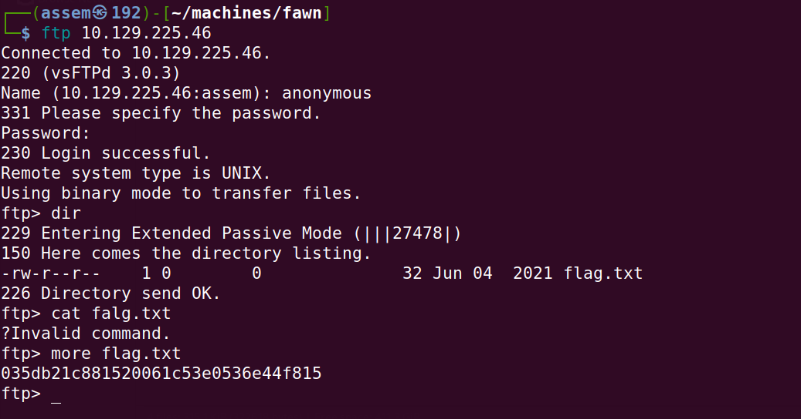
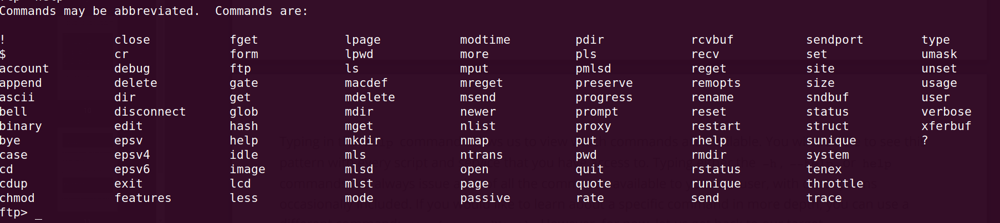

# Basic of penetration testing 

	**In our journy to learn penetration we take a machines in HTB to can explain the basics of penetration** 

## fawn_machine
	
   - after connecting with vpn will spawn the machine and you will have the ip address for this machine .
   - as we explained in meow machine you must know how to download vpn connect with HTB server and ping for IP_address.

   ### HERE WE GO .

   - when you ask yourslef **what can I do with  the IP ?**  if your answer was that you will search about ports with nmap 
   that means you are right .

   - go to terminal in your device and type this command:

    ```sudo nmap -sV -sC -A {ip_address}``` you can search seperatly to learn how to use nmap.

   

   - when you look in nmap report and try to find any open ports you will got that the `21/tcp` and the service `ftp` on this port and 
        the version is `vsftpd 3.0.3`.
   
   - with doing a quick search in google about ```what is FTP protocol?``` you will got that .
  			
 
    
- you must not skip this point without searching about ftp protocol in wikipedia.

#### THE BEST INFORMATION YOU SHOULD KNOW IN THIS WRITE UP .

***What is anonymous FTP (File Transfer Protocol)?***

- Anonymous File Transfer Protocol (FTP) is a method that lets users access public files from a remote server or archive site without  
  requiring them to identify themselves to the server or site. The user uses an FTP program or the FTP command interface and enters "anonymous" as their user ID. The password may be furnished by the FTP server or the user may provide their own.

- Anonymous FTP is a way for remote users to use an FTP server even if they don't have an assigned user ID and password.

   It enables  unprotected access of selected information about a remote system without entering a password. The information is usually publicly accessible, which means it can be read by anyone who logs into the server. However, the remote site determines what this information would be or how much would be available for general access. The person or organization that owns the information and the remote system must control their information and ensure that only appropriate information is made available for public access.


##### foothold .

- after you learned what is ftp , lets try to attack this machine with ftp command : with user:"anonymous" and
       password:"no password" just click enter.
- enter this command ```ftp -h ```to know how ftp command works .

 


 - as you see we will use ftp command as following ```ftp {IP_address}.

 

 - you know what you will do when the ftp server ask about id and password .

 - you will type anonymous in id and will type no password just klicking enter.

 

 - as you see we enter `anonymous` and just click enter in password field , and we got an successful login .

 - then you type `dir` to show the directory in the system.

 - then you type `more flag.txt` to display the internal content in the flag text.

 - then you got the flag and solve the machine . 


***what if you don't know how to interact with the system when you get in ?***
- you just typ the `help` command like this :-



- and here you got all command to know how to deal with the system.
